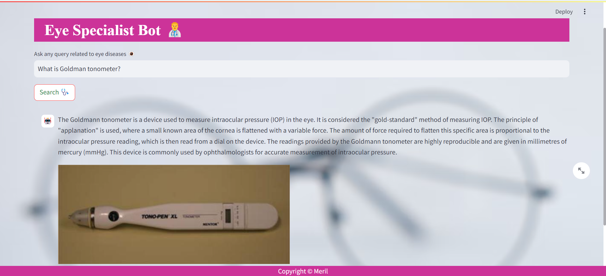

# MultiModal Chat App

The Multimodal Chat App is a Python application that allows you to chat with multiple PDF documents(Currently working on single pdf, but can work for multiple pdf's with minor code change). You can ask questions about the PDFs using natural language, and the application will provide relevant responses along with Images based on the content of the documents. This app utilizes a language model to generate accurate answers to your queries. Please note that the app will only respond to questions related to the loaded PDFs.

## How It Works
------------



The application follows these steps to provide responses to your questions:

1. PDF Loading and Parsing: The app reads PDF documents and extracts their text content, Image content & table content. It stores extracted images in a separate folder that can be used for analyzing later with pretrained model.

2. Text Chunking: The extracted text is divided into smaller chunks that can be processed effectively.

3. Language Model: The application utilizes a language model to generate vector representations (embeddings) of the text chunks. I am using gpt-3.5-turbo for text summarization & gemini-pro-vision for Image analysis. I have used this two models as this are free and fast, could have used llama2 or Mistral locally but I don't have much computing power in my current system as well they're accuracy is low. For more precise Image analysis we could have use gpt-4-vision.

4. Similarity Matching: When you ask a question, the app compares it with the text & image chunks and identifies the most semantically similar ones.

5. Response Generation: The selected chunks are passed to the language model, which generates a response based on the relevant content of the PDFs.

## Dependencies and Installation
----------------------------
To install the Chat App, please follow these steps:

1. Tesseract & poppler should be installed manually if using windows and add to variable path.

2. Install the required dependencies by running the following command:
   ```
   pip install -r requirements.txt
   ```

3. Obtain an API key from OpenAI and add it to the `.env` file in the project directory for running UI.
```commandline
OPENAI_API_KEY=your_secrit_api_key
```
4. To rerun whole notebook and create index you should have google gemini API key as well.

## Usage
-----
To use the MultiPDF Chat App, follow these steps:

1. Ensure that you have installed the required dependencies and added the OpenAI API key to the `.env` file.

2. Run the `main.py` file using the Streamlit CLI. Execute the following command:
   ```
   streamlit run app.py
   ```

3. The application will launch in your default web browser, displaying the user interface.

4. Ask questions in natural language about the loaded PDFs using the chat interface.
